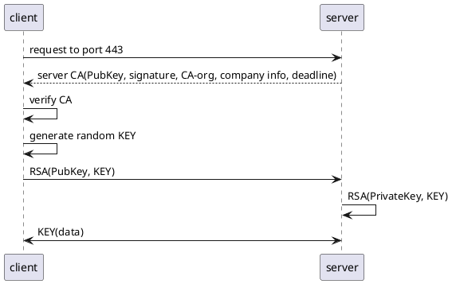

# https流程

## 细分步骤
1. client端向server端的443端口发出https请求；
2. server端向client返回CA证书； CA证书中包含：server端公钥、证书的电子签名、证书颁发机构、公司信息、有效期等；
3. client端收到server端返回的CA证书，验证其是否有效：是否是可信机构颁发、是否过期、证书中记录的域名与实际域名是否一致；
4. 确认可信后，client端从CA中取出server的公钥A；
5. client端生成一个随机密码KEY，将KEY通过A加密后，传输给server端；
6. server端使用私钥对KEY进行解密，获取到KEY；
7. client端和server端互相使用KEY对传输的数据进行加解密通信；

## 流程图
